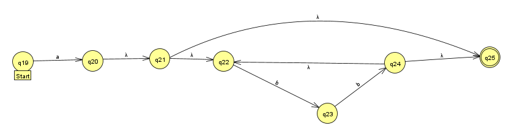
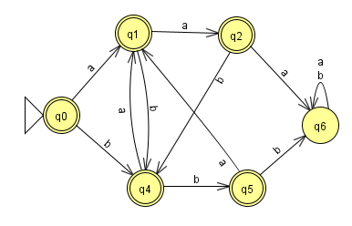
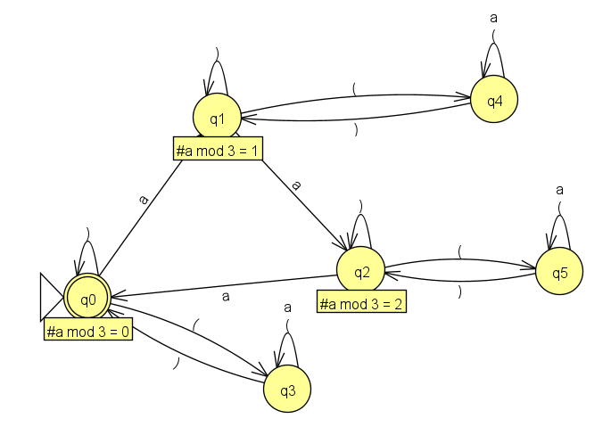
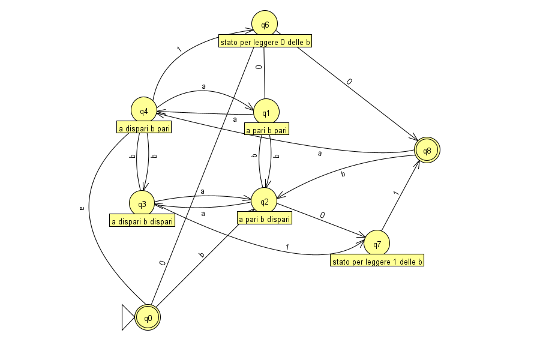
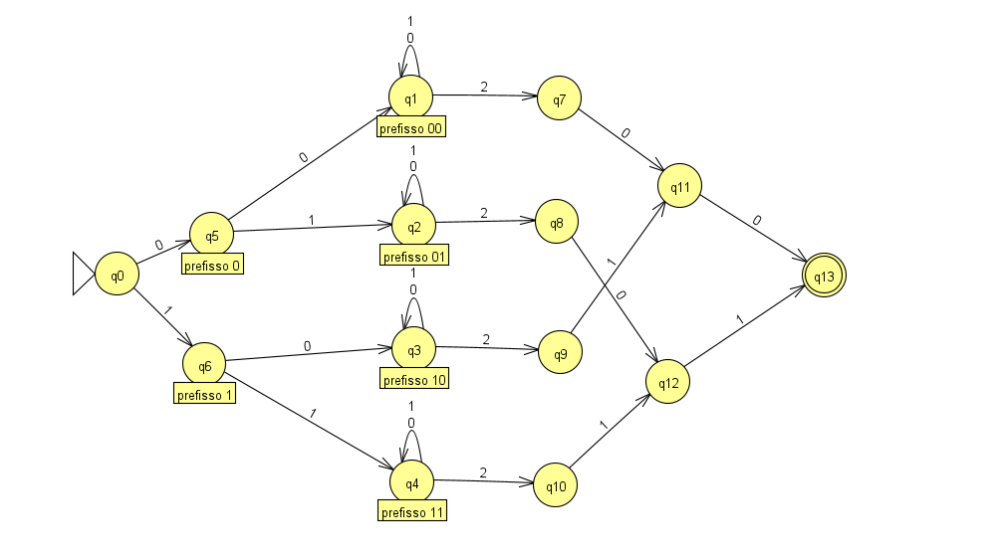
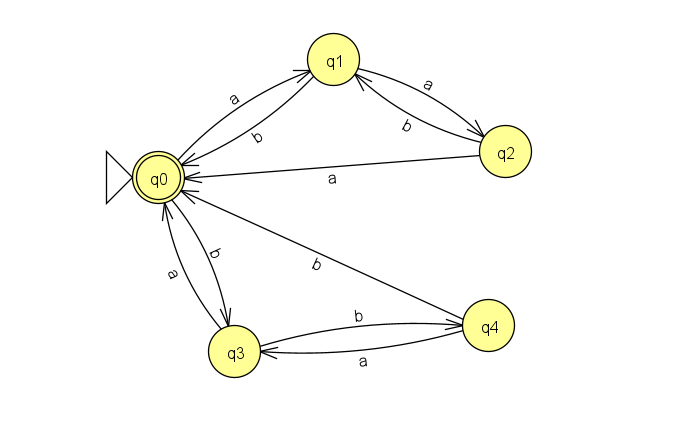
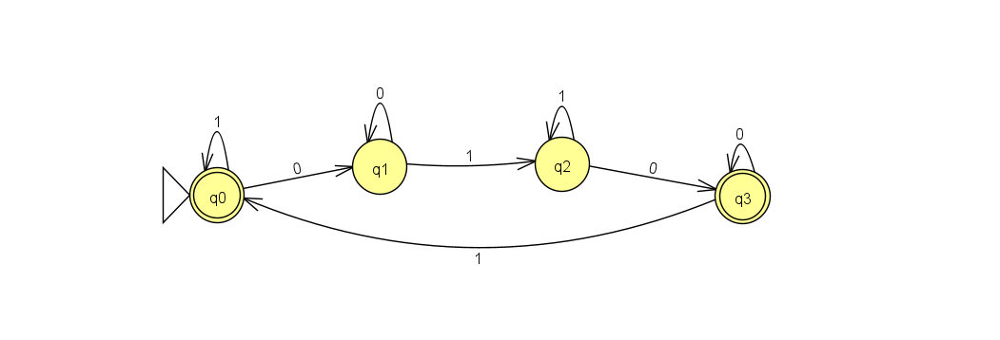
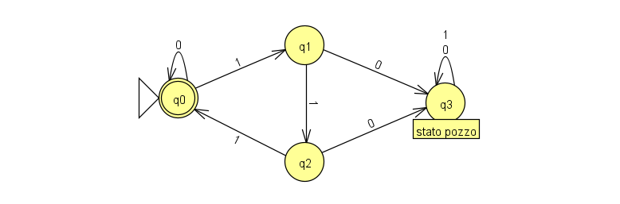
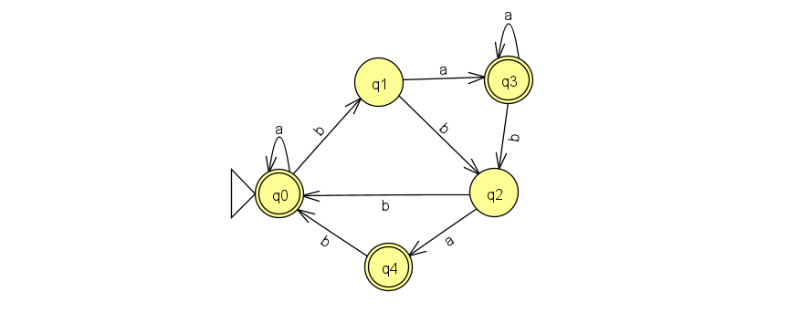
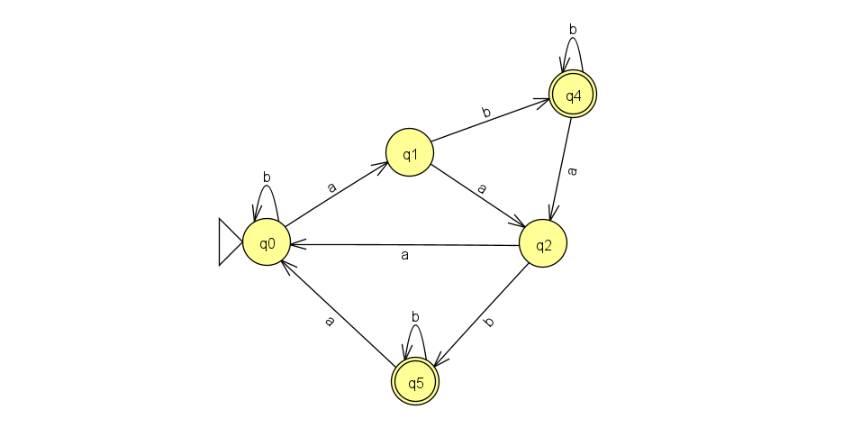

# LCMC

## NFA-&-epsilon-NFA

### Creazione NFA e epsilon-NFA a partire da un linguaggio

#### Esame-2022-Febbraio-15-eps-nfa

Esercizio 1. Costruire un ε-NFA per il linguaggio L su alfabeto {1,2,3} delle stringhe w, con |w| ≥ 1, in cui, indicato con X l’ultimo numero in w (cioè il numero X tale che w=vX con v$\in${1,2,3}*), il numero X appare almeno X volte dentro w. Ad esempio 1, 21, 11, 1232, 32323, 3333 appartengono ad L mentre ε, 2, 12, 33 non vi appartengono.

---
### Creazione epsilon-NFA a partire da una RE

---
#### Esame-2022-Settembre-09-re-to-eps-nfa

Esercizio 2. Data l'espressione regolare $(aa)^*(b^*+a(bb)^*)$ trasformarla in un -NFA utilizzando la trasformazione vista a lezione (cioè quella definita nel libro di testo).

Verranno mostrati per gradi i diversi passaggi.

$$aa$$

$$(aa)^*$$

$$b$$

$$b^*$$

$$(bb)^*$$

$$a(bb)^*$$

$$b^*+a(bb)^*$$
> La label start è un errore

$$(aa)^*(b^*+a(bb)^*)$$

---
## CFG

### Creazione CFG a partire da un linguaggio

#### Simulazione-Esame-2022-Dicembre-14-cfg

Esercizio 2. Definire una grammatica libera dal contesto che genera il linguaggio delle stringhe binarie con un ugual numero di 0 ed 1

Possiamo considerare una condizione in cui ogni volta che viene creato uno 0 è necessario creare un 1 e viceversa.

$
S \to 0AS|1BS|\epsilon \\
A \to 1|0AA \\
B \to 0|1BB
$

In questo modo quando entriamo in $A$, lo facciamo sapendo di aver già prodotto uno zero (grazie a $S$), di conseguenza o produciamo un 1 o produciamo un ulteriore 0 dovendo però poi inserire $AA$ per produrre i corrispettivi 1.
Discorso speculare per $B$

## Espressioni Regolari

### Creazione RE a partire da un linguaggio

#### Esame-2022-Settembre-09-re

Esercizio 1. Definire (direttamente senza far trasformazioni) un’espressione regolare che rappresenti il linguaggio L su alfabeto {a,b} delle stringhe $a^nb^m$, con n,m ≥ 0, tali che, considerato n mod 2 = 1 e m mod 3 ≠ 2. Ad esempio a, ab, aaaaa, aaabbbb, abbb appartengono al linguaggio mentre ε, b, abb, aa, aab, abbbbb e ba non vi appartengono.

$$
a(aa)^*(bbb)^*(b+\epsilon)
$$

---
#### Esame-2020-Settembre-08-re

Esercizio 1. Definire (direttamente, senza fare trasformazioni) un’espressione regolare che rappresenti il linguaggio L su alfabeto {a,b} delle stringhe $a^nb^m$, con n,m ≥ 0, per cui valga: se n mod 2 = 0 allora m mod 3 = 1, se invece n mod 2 = 1 allora m mod 3 = 2. Ad esempio aab, b, bbbb, aaabb, abbbbb, appartengono al linguaggio L mentre ε, a, aa, bb, bbb, baa, aabb, aaab, non vi appartengono. Trasformare, poi, l’espressione regolare in ε-NFA utilizzando la trasformazione vista a lezione (cioè quella definita nel libro di testo).

Si può definire l'espressione regolare in quest maniera:
$$
((aa)^*b(bbb)^*)+(a(aa)^*bb(bbb)^*)
$$
In questo modo prima di tutto viene rispettato l'ordine dei cartteri del linguaggio. Inoltre è possibile vedere, nel primo caso che il numero delle "a" è sempre pari a cui viene concatenato un numero di "b" che da sempre 1 per modulo di 3 visto che abbiamo una "b" o un multiplo di 3 di "b" più una "b".
Nel secondo caso invece abbiamo sempre un numero dispari di "a" a cui vengono concatenate un numero di "b" sempre uguale a 2 per modulo di 3. Il procedimento è analogo al caso in cui le "a" sono in numero pari, solo che vengono aggiunte 2 "b"

---

### Creazione RE a partire da automa

#### Esame-2022-02-15-automa-to-re

Dato l'automa qui sotto, trasformarlo in espressione regolare con il metodo di eliminazione degli stati visto a lezione.

Procedendo all'eliminazione degli stati otteremo un automa di così fatto:

A questo punto drovremo procedere a considerare i singoli casi di stati di accettazione, quindi il caso in cui solo q2 sia di accettazione e il caso in cui solo q5 sia di accettazione

**Caso q5 stato finale** - Procediamo all'eliminazione di q2

Tenendo presente quanto fatto a lezione e la *"formula della casa al lago"* otteniamo:
$$
((a+ba)(ba)^*abbb)^*(a+ba)(ba)^*
$$

**Caso q2 stato finale** - Procediamo all'eliminazione di q5

In questo caso otteniamo

$$
((a+ba)(ba)^*abbb)^*(a+ba)(ba)^*a)
$$

L'espressione regolare finale quindi risulta essere

$$
((a+ba)(ba)^*abbb)^*(a+ba)(ba)^* + ((a+ba)(ba)^*abbb)^*(a+ba)(ba)^*a) \\
$$

Semplificabile in

$$
((a+ba)(ba)^*abbb)^*(a+ba)(ba)^*(\epsilon + a)
$$

## DFA

### Creazione DFA a partire da un linguaggio

---
#### Simulazione-Esame-2022-12-14-dfa

Esercizio 1: Definire un DFA che riconosce il linguaggio delle stringhe binarie che contengono un numero pari di 0 oppure che interpreate come numero in base 2 rappresentano un numero multiplo di 3

In questa risoluzione è mostrato come unire due automi date le specifiche dell'esercizio. **Gli stati iniziali degli automi parziali sono q0 e q2**. L'automa finale racchiude le coppie degli stati di quelli iniziali e ci si muove fra le coppie considerando le transizioni di entrambi per "0" e per "1". Gli stati finali sono quelli che possiedono nella coppia uno degli stati finali degli automi parziali, quindi q0 e q2.
Il secondo parziale si muove con gli "0" e "1" tenendo conto che ad un numero binario se aggiungiamo uno "0" allora raddoppieremo il resto precedente andando a raddoppiare il numero; mentre aggiungendo "1" andiamo a raddoppiare e a sommare un'unità.

---
#### Esame-2022-Giugno-28-dfa

Esercizio 1. Definire (direttamente, senza fare trasformazioni) un DFA che rappresenti il linguaggio sull’alfabeto {a,b} delle stringhe $a^nb^m$ in cui 
$$n \space mod(2) = 1 \\ m \space mod(3) \neq 2$$
Ad esempio a, ab, aaaaa, aaabbbb, abbb appartengono al linguaggio mentre ε, b, abb, aa, aab, abbbbb e ba non vi appartengono.

---
#### Esame-2020-Gennaio-31-dfa

Costruire un DFA per il linguaggio **L** su alfabeto {a,b} delle stringhe w in cui lo stesso simbolo non appare mai tre volte consecutivamente. Ad esempio ***aabbaba***, ***ababb***, ***ε*** appartengono ad L mentre ***aaab***, ***aaaa***, ***aaababbb*** non vi appartengono. Nel realizzare il DFA fare attenzione ad utilizzare un numero minimo di stati (non si richiede, però, di verificare la effettiva minimalità con l’algoritmo di minimizzazione).

---
#### Esame-2020-Settembre-08-dfa

##### Esercizio-1

Definire (direttamente, senza fare trasformazioni) un’espressione regolare che rappresenti il linguaggio L su alfabeto {a,b} delle stringhe a^n b^m, con n,m ≥ 0, per cui valga: se n mod 2 = 0 allora m mod 3 = 1, se invece n mod 2 = 1 allora m mod 3 = 2.
Ad esempio aab, b, bbbb, aaabb, abbbbb, appartengono al linguaggio L mentre ε, a, aa, bb, bbb, baa, aabb, aaab, non vi appartengono. Trasformare, poi, l’espressione regolare in ε-NFA utilizzando la trasformazione vista a lezione (cioè quella definita nel libro di testo).

##### Esercizio-2

Costruire (direttamente, senza fare trasformazioni) un DFA per il linguaggio L dell’esercizio 1. Nel realizzare il DFA fare attenzione ad utilizzare un numero minimo di stati: verificare la effettiva minimalità tramite l’algoritmo riempi-tabella (utilizzare una crocetta di tipo diverso ad ogni passata).

*Sono riportati entrambi gli esercizi dato che le specifiche del linguaggio di quello relativo al DFA era nell'esercizio precedente*

Gli stati di **b** (**q2**,**q3**,**q4**) rappresentano i tre possibili moduli differentemente in base a come entriamo nel ciclo: se arriviamo in **q2** da **q0** allora **q2** indicherà una sequenza di **b** con modulo uguale a 1, se arriviamo da **q1** a **q3** questo ruolo lo avrà **q3**.
Lo stato **q6** viene raggiunto quando durante le letture di **b** incontriamo una **a** che ci porterebbe ad avere inevitabilmente una stringa che non può più far parte del linguaggio.

---
#### Esame-2019-Luglio-09-dfa

Costruire un DFA per il linguaggio L su alfabeto {0,1,2} che contiene le stringhe **w** in cui la somma dei numeri (0, 1 o 2) contenuti in **w** sia un multiplo di 3. Ad esempio 22101, 1011, 0021, 211110, 00000, 0, ε appartengono ad L mentre 1, 2, 110, 010, 22 non vi appartengono. Nel realizzare il DFA fare attenzione ad utilizzare il numero minimo di stati. 
In seguito, verificare che il DFA realizzato sia effettivamente minimo usando l’algoritmo riempi-tabella visto a lezione (cioè quello definito nel libro di testo). Mostrare la tabella, utilizzando una crocetta di tipo diverso ad ogni passata.

L'esercizio si può risolvere come altri che sono stati visti dove gli stati rappresentano il risultato dei moduli. In questo caso durante la consumazione della stringa ci spostiamo lungo tali risultati possibili 0, 1, 2:
-  0 non porta a cambiare stato dato che la somma non cambia; 
-  1 aumenta il risultato del modulo di un'unità
-  2 aumenta il risultato del modulo di due unità

---

#### Esame-2019-Febbraio-02-dfa

Costruire un DFA per il linguaggio L su alfabeto {a,(,)} in cui il numero delle a sia un multiplo di 3 ignorando tutto quello che c'è tra una parentesi tonda aperta (incontrata leggendo la stringa da sinistra a destra) e la prima parentesi tonda chiusa che la segue (o la fine della stringa in caso non ci sia una parentesi tonda chiusa che la segue). Le parentesi tonde, cioè, sono come delimitatori di commenti di un linguaggio di programmazione, dentro cui le a non vengono contate: una parentesi tonda aperta apre il commento e la prima parentesi tonda chiusa che lo segue chiude il commento. Ad esempio a()a()()a, a(*a*)aaa(*a*)aa, a)a))a, ε, a((*a*)aa, a(*a*()aa(a, (((, )((*aa*, (*a*)) appartengono ad L mentre aa(*a*, (*aa*)a non vi appartengono (le parti ignorate, che non contribuiscono al conteggio delle a, sono in *italic* solo per chiarire il motivo dell’appartenenza o meno).

Anche in questo caso come negli esercizi precedenti il concetto di "multiplo" è stato trattato sfruttando i moduli. Seguendo il percorso $q1 \to q2 \to q3$ incrementiamo la cardinalità delle "a" nella stringa e quindi anche il modulo. Da ogni stato se leggiamo un "(" entriamo in un corrispettivo stato che permette di non prendere in considerazione ulteriori "a" e "(" fino a che non troveremeo una ")". L'unico differente è $q3$ che rappresenta anch'esso uno stato finale dato che il numero di "a" che già avevamo prima di arrivarci soddisfava le condizioni del linguaggio.

---
#### Esame-2019-Gennaio-15-dfa

Costruire un DFA per il linguaggio L su alfabeto {a,b,0,1} (composto dalle  lettere “a” e “b” e dai numeri “0” e “1”), definito come segue. Una stringa $w \in L$ se e solo se ogni suo gruppo di lettere è seguito da due numeri $n_1 ,n_2 \in {0,1}$ tali che, indicato con $k_a$ il numero di “a” nel gruppo e con $k_b$ il numero di “b” nel gruppo: $n_1=0$ se $k_a$ è pari
($n_1=1$ altrimenti) e $n_2=0$ se $k_b$ è pari ($n_2=1$ altrimenti). Ad esempio $aabab10ab11abba00 \in L$ (il primo gruppo di lettere ha un numero dispari di “a” ed un numero pari di “b”, come indicato da “10”, il secondo un numero dispari sia di “a” che di “b”, cioè “11”, ed il terzo un numero pari sia di “a” che di “b”, cioè “00”). Altri esempi di stringhe in L sono:
aab01, aaa10b01, 0100, ε, abb1011, aab010b01. Esempi di stringhe non in L sono: ab10, aabb0, a, aaab1ab11. Nel costruire il DFA si eviti di introdurre stati tra loro equivalenti: lo si costruisca il più piccolo possibile.

> La soluzione presentata tiene conto della struttura del linguaggio e non tanto alle stringhe date come esempio che non si sa se essere effettivamente corrette date le specifiche. Ad esempio *0100, abb1011, aab010b01* non rispettano le regole che traspaiono dal linguaggio.

Le transizioni che non sono presenti nell'automa portano allo stato pozzo, il quale non è stato messo per rendere più leggibile lo schema.
Spostandosi fra q1 q2 q3 q4 è possibile ritrovarsi nelle condizioni in cui la stringa, precedente alla coppia di numeri, abbia:
- un numero di "a" pari e "b" pari
- un numero di "a" pari e "b" dispari
- un numero di "a" dispari e "b" pari
- un numero di "a" dispari e "b" dispari

In base allo stato di questi da cui usciamo possiamo andare in q6 o q7:
- q6 sta ad indicare una situzione in cui il numero di "b" è pari e ciò comporta, dopo avere letto il numero relativo ad "a", di dovere leggere uno zero
- q7 è speculare, quindi relativo ad un numero di b dispari
In entrambi gli stati possiamo arrivare sia con un 1 che con uno 0 in base al fatto che le "a" siano dispari o pari

Infine, da q8 ci muoviamo come dallo stato iniziale andando in una situazione di "a" o "b" dispari.

> Non è chiaro se una stringa possa avere una coppia di zeri dopo la precedente coppia di numeri come ad esempio ab1100. In caso lo fosse questo secondo automa lo permette.

In questo caso abbiamo un'ulteriore transizione che va da q8 a q6 leggendo uno zero

---
#### Esame-2018-Gennaio-16-dfa

Esercizio 1. Realizzare un DFA che riconosca il linguaggio su alfabeto {0,1,2} che contiente le stringhe $x2y$, dove $x$ e $y$ sono stringhe su {0,1} tali che: $x$ ha lunghezza almeno 2 e $y$ è il prefisso di lunghezza 2 di $x$. Ad esempio 1011210, 01201 ed 11000211 appartengono al linguaggio mentre 1210, 110 ed 0120 non vi appartengono.

Le transizioni che non sono presenti portano allo stato pozzo. In questo caso abbiamo bisogno di 4 stati per poter memorizzare i 4 possibili stati che ci interessano e che $y$ dovrà "ricordare". Dopo avere letto i primi caretteri l'automa continua a ciclare su 0 e 1 fino a che non capiterà un 2, solo allora procederà alla sequenza sucessiva.

#### Esame-2017-Giugno-13-dfa

Esercizio 2. Definire (direttamente, senza fare trasformazioni) un DFA che rappresenti il linguaggio sull’alfabeto {a,b} delle stringhe in cui il numero $n$ di "a" ed il numero $m$ di "b" sono tali che: $n$ ed $m$ danno lo stesso resto quando divisi per 3, cioè $n \space mod(3) = m\space mod(3)$. Ad esempio abaabb, bbabb, abab, aaa ed ε appartengono al linguaggio mentre bb, a, aabbb e babaaa non vi appartengono.

> Di questo esercizio sono presenti due versioni di DFA una più estesa e una più contratta.

Qui è possibile vedere la versione estesa, dove ogni possibile combinazione dei resti è stata modellata con uno stato. Le etichette degli stati ci mostrano a quanto ammonta il resto per il numero di "a" e per il numero di "b" (il primo numero dopo l'uguale si riferisce alle "a" e quello dopo "/" alle "b"). Leggendo ogni volta input "a" o "b" entriamo in una configurazione diversa.

In questo DFA vi sono 4 stati in meno e i 3 stati finali precedenti sono stati condensati in uno soltanto. Aumentando le "a" aumentano le "b" per "tornare indietro" e quindi avere un medesimo resto, viceversa aumentando le "b".

---
#### Esame-2017-Febbraio-22-dfa

Esercizio 1. Definire (direttamente, senza fare trasformazioni) un’espressione regolare che rappresenti il linguaggio sull’alfabeto {0,1} delle stringhe in cui il numero di gruppi di 0 è pari. Ad esempio 011001, 1010110010, 111 ed ε appartengono al linguaggio mentre 0110010, 1110 ed 1001 non vi appartengono.

Esercizio 2. Realizzare (direttamente, senza fare trasformazioni) un DFA con 4 stati che riconosca il linguaggio dell’esercizio precedente. Dire, tramite l’algoritmo riempi-tabella visto a lezione/nel libro di testo (utilizzare una crocetta di tipo diverso ad ogni passata) se tale DFA è equivalente o meno al DFA...

*Sono riportati entrambi gli esercizi dato che le specifiche del linguaggio di quello relativo al DFA era nell'esercizio precedente*

---
#### Esame-2017-Gennaio-13

Esercizio 1. Realizzare un DFA che riconosca il linguaggio sull’alfabeto binario {0,1} che contiene le stringhe in cui ogni gruppo di 1 adiacenti è di lunghezza multipla di 3. Ad esempio 011100111111 appartiene al linguaggio mentre 1110010 non vi appartiene.

---
#### Esame-2016-Giugno-14

Esercizio 1. Dato l'alfabeto {a,b} realizzare un DFA che riconosce le stringhe che terminano con “a” o nelle quali il numero di “b” sia multiplo di 3.

Dal momento che 0 è multiplo di tutti i numero, anche la stringa vuota viene accettata. Il percorso $q1 \to q2 \to q3$ si muove lungo il modulo per 3 del numero delle "b". Da q1 e q2 possiamo andare inoltre in uno stato di accettazione leggendo un carattere "a".

---
#### Esame-2016-Febbario-19

Esercizio 2. Costruire un DFA che riconosce le stringhe sull’alfabeto {a,b} che non contengono “aa” e trasformarlo in espressione regolare con il metodo di eliminazione degli stati visto a lezione (cioè quello definito nel libro di testo).

---
#### Esame-2016-Febbraio-02

Esercizio 1: Dato l'alfabeto {a,b} realizzare un DFA che riconosce le stringhe che terminano con “b” e nelle quali il numero di “a” non sia multiplo di 3.

---
#### Esame-2016-Gennaio-18

Esercizio 1. Dato l'alfabeto {a,b} realizzare un DFA che riconosce le stringhe che contengono “ba” oppure hanno un numero pari di “a”.

> Nota: gli stati "q1,q4" e "q0,q4" possono essere collasati in uno mettendoci un ulteriore autociclo per "a" oltre che per "b"

In questa risoluzione è mostrato come unire due automi date le specifiche dell'esercizio. **Gli stati iniziali degli automi parziali sono q0 e q2**. L'automa finale racchiude le coppie degli stati di quelli iniziali e ci si muove fra le coppie considerando le transizioni di entrambi per "a" e per "b". Gli stati finali sono quelli che possiedono nella coppia uno degli stati finali degli automi parziali, quindi q0 e q4.

---

### Creazione DFA a partire da un epsilon-NFA

#### Esame-2022-Giugno-28-eps-nfa-to-dfa

Dato l'$\epsilon$-NFA su alfabeto {0,1,2}:

Trasformarlo in DFA utilizzando la trasformazione vista a lezione.

#### Esame-2020-Giugno-26-eps-nfa-to-dfa

Dato l'$\epsilon$-NFA

Trasformarlo in DFA utilizzando la trasformazione vista a lezione.

## Esami

### 2022-09-09-exam

[Esercizio 1](#esame-2022-settembre-09-re)

[Esercizio 2](#esame-2022-settembre-09-re-to-eps-nfa)

### 2022-06-28-exam

[Esercizio 1](#esame-2022-giugno-28-dfa)

[Esercizio 2](#esame-2022-giugno-28-eps-nfa-to-dfa)

### 2022-02-15-exam

[Esercizio 1](#esame-2022-febbraio-15-eps-nfa)

[Esercizio 2](#esame-2022-02-15-automa-to-re)